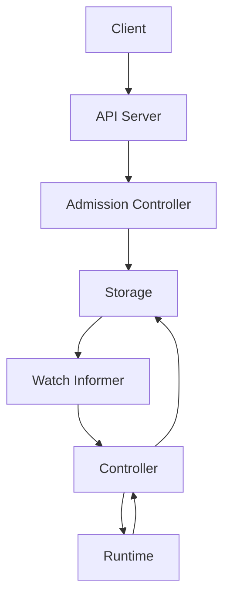

# Mini Control Plane

Mini Control Plane is an educational, Kubernetes-inspired control plane written in Go.
It demonstrates the core architectural patterns used by Kubernetes and other CNCF
projects, including declarative APIs, admission control, reconciliation loops,
watch-based informers, leader election, and status management.

This project is intentionally focused on *control-plane mechanics* rather than
workload execution or container orchestration.

---
### Version 2 Overview

This release evolves the project toward a Kubernetes-style control plane with real distributed systems fundamentals, including:
- etcd-backed storage with strong consistency and MVCC (`resourceVersion`)
- Optimistic concurrency control (compare-and-swap)
- Atomic status subresource updates and structured Conditions
- Event-driven watch + informer reconciliation (no polling)
---

## Motivation

Kubernetes is widely used, but its internal control-plane behavior is often treated
as a black box. Many engineers can operate Kubernetes without fully understanding
how its controllers, admission logic, and reconciliation model actually work.

Mini Control Plane exists to:
- make Kubernetes control-plane concepts explicit
- provide a readable reference implementation
- serve as a learning platform for cloud-native system design

The project favors clarity and correctness over scale and production optimizations.

---

## Design Goals

- Declarative, spec-driven system
- Clear separation between desired state (spec) and observed state (status)
- Idempotent reconciliation
- Event-driven controllers using watch & informers
- Policy enforcement via admission control
- Safe multi-controller operation through leader election
- Minimal dependencies and readable Go code

---

## High-Level Architecture




The API server is the single entry point for user intent.
Controllers react to state changes and converge the system toward the desired state.

---

## Core Components

### API Server
Acts as the control-plane front door.
Responsible for accepting resource definitions, enforcing admission policies,
persisting desired state, and emitting watch events.

### Admission Controller
Validates resources at creation time and records admission outcomes as status conditions.

### Storage Layer
Abstracted storage interface using etcd as the backend.  
The etcd implementation supports MVCC with `resourceVersion`, optimistic concurrency control, and atomic updates, aligning with real Kubernetes API server semantics.

### Watch & Informers
Controllers subscribe to resource change events instead of polling, enabling
immediate reconciliation.

### Controller
Implements reconciliation logic, drift detection, and status updates.

### Leader Election
Ensures only one controller instance actively reconciles at a time.
## Resource Model

Resources follow Kubernetes-style structure:

```yaml
spec:
  name: app-example
  replicas: 3
status:
  currentReplicas: 3
  conditions:
    - type: AdmissionApproved
      status: "True"
      reason: Accepted
```
- spec is user-owned and immutable by controllers
- status is system-owned and reflects observed state
- Controllers never mutate spec

## Key Concepts Demonstrated

- Declarative desired state
- Eventual consistency
- Idempotent reconciliation
- Drift detection and self-healing
- Admission-time policy enforcement
- Watch-based informers
- Leader election and safety

## Non-Goals

- Full Kubernetes API compatibility
- Production-grade scalability
- Container scheduling or networking
- etcd reimplementation

This project is intentionally scoped to control-plane behavior rather than
full orchestration.

---

## v2 Enhancements

This version focuses on architectural correctness and core control-plane concepts rather than scope expansion.

- Migrated from file-backed persistence to etcd for distributed consistency.
- Implemented MVCC (`resourceVersion`) and atomic update guarantees.
- Added watch based informers for real time event propagation.
- Structured status updates via a dedicated subresource and Conditions.

---

### Project Status

| Category | Status |
|----------|--------|
| Stage | Experimental |
| Maturity | CNCF Sandbox –style |
| Stability | Not production-ready |
| Deployment | Educational / Learning purposes |


---

## Governance

This project follows lightweight governance inspired by CNCF principles.

### Maintainer
- Aditya Pathak (initial author and maintainer)

### Decision Making
- Technical decisions are made by the maintainer
- Design discussions are documented through issues

### Contributions
Contributions are welcome in the form of:
- design discussions
- documentation improvements
- bug reports
- feature proposals

This project follows the CNCF Code of Conduct:
https://github.com/cncf/foundation/blob/main/code-of-conduct.md

---

## Roadmap

### Short Term
- Resource versioning and optimistic concurrency
- Improved error handling and status reporting
- Structured event objects
- Expanded test coverage

### Medium Term
- Mutating admission controllers
- API versioning (v1alpha1, v1beta1)
- Simple scheduler abstraction
- Pluggable storage backends

### Long Term
- RBAC-style authorization
- Multi-resource dependency graph
- Controller crash recovery
- Educational visualizations of reconciliation

---

## License

Apache License 2.0
