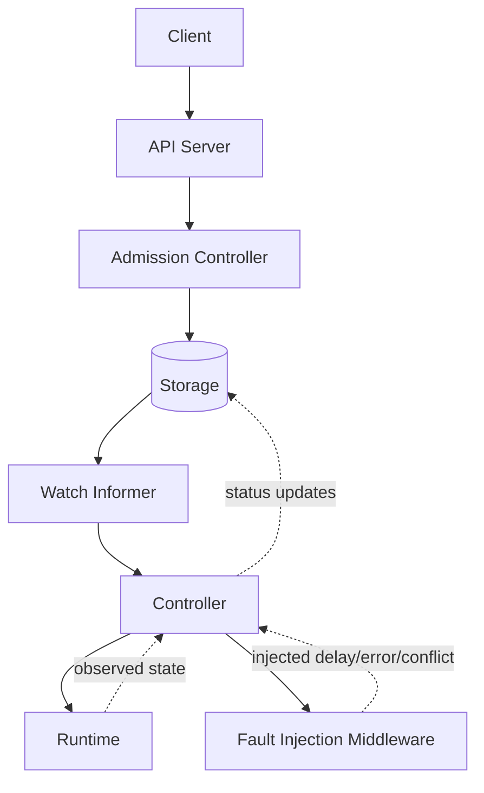

# Mini Control Plane

Mini Control Plane is a research prototype for white-box fault analysis of Kubernetes-style control-plane semantics. It focuses on the mechanics that make control planes correct under concurrency: declarative resources, MVCC storage, watch-driven reconciliation, leader election, scheduler status updates, and controlled fault injection.

This repository accompanies the paper described in [docs/paper.md](docs/paper.md). It is organized for artifact evaluation: experiment configurations live in `specs/experiments/`, structured results belong in `experiments/results/`, and `analysis/aggregate_conflicts.py` aggregates conflict logs for Table 1-style summaries.

## Artifact Status

| Category | Status |
|----------|--------|
| Stage | Experimental research artifact |
| Scope | Kubernetes-style control-plane semantics |
| Storage | etcd MVCC plus file-backed test storage |
| Reproducibility | Versioned experiment configs and analysis script |
| Production readiness | Not production-ready |

## Research Questions

- How do Kubernetes-style controllers behave under conflicting status updates?
- Which fault-injection scenarios expose unsafe reconciliation behavior?
- How do leader-election timing parameters affect controller conflicts?
- Can structured logs connect implementation behavior to reproducible analysis?

## High-Level Architecture


```mermaid
flowchart TD
    Client --> APIServer[API Server]
    APIServer --> Admission[Admission Controller]
    Admission --> Storage[(Storage)]

    Storage --> Watch[Watch Informer]
    Watch --> Controller[Controller]
    Controller --> Runtime[Runtime]
    Controller --> Fault[Fault Injection Middleware]

    Runtime -. observed state .-> Controller
    Fault -. injected delay/error/conflict .-> Controller
    Controller -. status updates .-> Storage
```

The API server persists desired state, informers react to storage events, leader-elected controllers reconcile state, and the scheduler records placement decisions through the status subresource. State mutations use MVCC-style `resourceVersion` checks to detect conflicts and prevent lost updates.

## Core Components

### API Server

Accepts resource definitions, enforces admission policies, persists desired state, and exposes status updates.

### Storage Layer

Provides a storage interface with etcd-backed MVCC semantics and file-backed storage for local runs. The etcd implementation uses compare-and-swap updates over `resourceVersion`.

### Watch and Informers

Controllers subscribe to resource changes instead of polling, allowing event-driven reconciliation and controlled conflict observation.

### Reconciler

Fetches the latest resource version by `spec.name`, converges observed replicas toward desired replicas, and updates only status.

### Scheduler

Assigns replicas to nodes and writes placement decisions through the status subresource.

### Leader Election

Ensures a single active controller in normal operation while allowing experiments to vary controller count and timing.

### Fault Injection

`pkg/fault/` provides middleware hooks for injecting delays and errors around control-plane operations. The experiment configs reference this middleware for fault-analysis runs.

## Reproducing the Experiments

1. Start etcd locally on `localhost:2379`.
2. Choose a Table 1 configuration from `specs/experiments/`.
3. Run the requested number of controller instances with the config's lease TTL and retry interval.
4. Write structured JSONL logs to `experiments/results/`.
5. Aggregate conflicts:

```bash
python analysis/aggregate_conflicts.py --pretty experiments/results/*.jsonl
```

The versioned Table 1 configs are:

| Config | Controllers | Lease TTL | Retry Interval |
|--------|-------------|-----------|----------------|
| `specs/experiments/table1-n1.yaml` | 1 | 5s | 2s |
| `specs/experiments/table1-n2.yaml` | 2 | 5s | 2s |
| `specs/experiments/table1-n4.yaml` | 4 | 5s | 2s |
| `specs/experiments/table1-n8.yaml` | 8 | 5s | 2s |

Runtime files such as `leader.lock` and unstructured `events.log` output are ignored and should not be committed.

## Resource Model

Resources follow a Kubernetes-style shape:

```yaml
metadata:
  name: app-example
spec:
  name: app-example
  replicas: 3
status:
  currentReplicas: 3
  conditions:
    - type: AdmissionApproved
      status: "True"
      reason: Accepted
```

- `spec` is user-owned desired state.
- `status` is system-owned observed state.
- Controllers update status, not spec.
- Storage keys are derived from `spec.name`.

## Repository Map

| Path | Purpose |
|------|---------|
| `pkg/api/` | Resource, status condition, and watch-event types |
| `pkg/apiserver/` | HTTP API server handlers |
| `pkg/storage/` | Storage interface plus etcd and file implementations |
| `pkg/reconciler/` | Reconciliation logic |
| `pkg/scheduler/` | Placement/status logic |
| `pkg/leader/` | Leader-election support |
| `pkg/fault/` | Fault-injection middleware |
| `specs/` | Resource specs and experiment configs |
| `experiments/` | Experiment documentation and result location |
| `analysis/` | Log aggregation and analysis scripts |
| `docs/paper.md` | Paper and citation metadata |

## Citation

```bibtex
@inproceedings{pathak2026minicontrolplane,
  title = {White-Box Fault Analysis for Kubernetes-Style Control Plane Semantics},
  author = {Pathak, Aditya},
  booktitle = {Proceedings of the International Conference on Distributed Computing and Networking},
  year = {2026},
  note = {Artifact: https://github.com/Phoenix1504e/mini-control-plane}
}
```

## Non-Goals

- Full Kubernetes API compatibility
- Production-grade scalability
- Container runtime, networking, or orchestration
- etcd reimplementation

## Governance

### Maintainer

- Aditya Pathak

### Contributions

Contributions are welcome for reproducibility improvements, documentation, controlled experiments, and bug fixes.

This project follows the CNCF Code of Conduct:
https://github.com/cncf/foundation/blob/main/code-of-conduct.md

## License

Apache License 2.0
