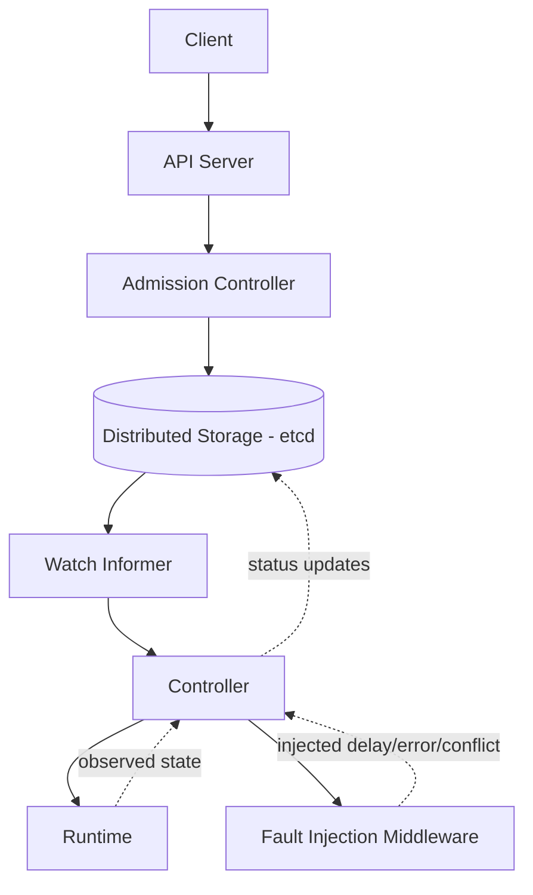

# Mini Control Plane

Mini Control Plane is a research prototype for white-box fault analysis of Kubernetes-style control-plane semantics. It focuses on the mechanics that make control planes correct under concurrency: declarative resources, MVCC storage, watch-driven reconciliation, leader election, scheduler status updates, and controlled fault injection.

This repository accompanies the paper: **"White-Box Fault Analysis for Kubernetes-Style Control Plane Semantics."** It is organized for artifact evaluation: experiment configurations live in `specs/experiments/`, aggregated results reside in `results/`, and `analyze_all_trials.py` provides the evaluation pipeline.
## Artifact Status

| Category | Status |
|----------|--------|
| Stage | Experimental research artifact |
| Scope | Kubernetes-style control-plane semantics |
| Storage | etcd MVCC (distributed 3-node) plus file-backed test storage |
| Reproducibility | Versioned experiment configs and analysis scripts |
| Production readiness | Not production-ready |

## Research Questions

- How do Kubernetes-style controllers behave under conflicting status updates?
- Which fault-injection scenarios expose unsafe reconciliation behavior?
- How do leader-election timing parameters affect controller conflicts?
- Can controller state converge under partial observability (watch event loss)?
- What is the tail-latency impact of Raft consensus in a distributed control plane?

## High-Level Architecture


```mermaid
flowchart TD
    Client --> APIServer[API Server]
    APIServer --> Admission[Admission Controller]
    Admission --> Storage[(Distributed Storage - etcd)]

    Storage --> Watch[Watch Informer]
    Watch --> Controller[Controller]
    Controller --> Runtime[Runtime]
    Controller --> Fault[Fault Injection Middleware]

    Runtime -. observed state .-> Controller
    Fault -. injected delay/error/conflict .-> Controller
    Controller -. status updates .-> Storage
```

## Core Components

- **API Server:** Accepts resource definitions, enforces admission, and persists state.
- **Storage Layer:** Implements etcd-backed MVCC semantics with `resourceVersion` locking.
- **Watch/Informer:** Enables event-driven reconciliation.
- **Reconciler:** Converges observed replicas toward desired replicas using Jittered Exponential Backoff.
- **Fault Injection:** `pkg/fault/` and `pkg/storage/watcher.go` provide middleware for probabilistic event dropping and latency injection.

## Reproducing the Experiments

### Baseline & Conflict Analysis
1. Start the cluster: `bash scripts/start_etcd_cluster.sh`
2. Aggregate conflicts: `python3 analyze_all_trials.py`
3. Advanced Evaluation: Distributed Robustness

 We evaluated the system in a 3-node Raft cluster with varying levels of observability faults (watch event drops)
### Advanced Evaluation: Distributed Robustness

| Metric | Baseline (3-Node) | Degraded (25% Watch Loss) |
| :--- | :--- | :--- |
| **Mean IAT** | ~626 ms | ~1168 ms |
| **P95 Latency** | 2.88 ms | 2.90 ms |
| **P99 Latency** | 4.17 ms | 4.16 ms |
 
## How to reproduce:
1. Clean: `pkill etcd && rm -rf /tmp/infra*.etcd`
2. Run: `python3 run_campaign.py --trials 10 --concurrency 8 --ops 100 --fault-rate 0.25`
3. Analyze: `python3 analyze_all_trials.py`

### Dependency Management: 
Before running scripts, ensure environment requirements are met: `pip install -r requirements.txt`

## Expected Output Snippet
When running the campaign, you should see logs generated in `experiments/`:

```{"timestamp": "2026-07-19T11:42:00Z", "event": "reconcile", "status": "success", "latency_ms": 2.1}```


#### Note: Results are saved in `experiments/fault-class-a/` and visualized in `results/thesis_resilience_graph.pdf`

## Resource Model
### Resources follow a Kubernetes-style shape:
```yaml
metadata:
  name: app-example
spec:
  name: app-example
  replicas: 3
status:
  currentReplicas: 3
  conditions:
    - type: AdmissionApproved
      status: "True"
```
### Experiment Configuration (Table 1)

| Config | Controllers | Lease TTL | Retry Interval |
| :--- | :--- | :--- | :--- |
| `specs/experiments/table1-n1.yaml` | 1 | 5s | 2s |
| `specs/experiments/table1-n2.yaml` | 2 | 5s | 2s |
| `specs/experiments/table1-n4.yaml` | 4 | 5s | 2s |
| `specs/experiments/table1-n8.yaml` | 8 | 5s | 2s |

### Repository Map
| Path | Purpose | 
| :--- | :--- |
| `pkg/storage/` | etcd MVCC and `WatchWithFaults` middleware |
| `pkg/reconciler/` | Reconciliation loop with jittered backoff |
| `scripts/` | Cluster orchestration (`start_etcd_cluster.sh`) | 
| `results/` | Final thesis metrics and PDF visualizations |
| `experiments/` | Raw JSONL event logs |
| `docs/` | Paper and manuscript metadata |

### Troubleshooting & FAQ
| Issue | Potential Cause | Fix |
| :--- | :--- | :--- |
| etcd fails to start | Port 2379 already in use | `pkill etcd` or change port in `scripts/start_etcd_cluster.sh` |
| Reconciliation loop hangs | Stale resource| VersionClear storage: `rm -rf /tmp/infra*.etcd` |
| Permission denied | Script execution bits | `chmod +x scripts/*.sh` |

### Acknowledgments
The author acknowledges the use of the `etcd` and `Kubernetes` open-source ecosystems, which provided the foundational semantics for this fault-analysis prototype.

### Citation
```
@inproceedings{pathak2026minicontrolplane,
  title = {White-Box Fault Analysis for Kubernetes-Style Control Plane Semantics},
  author = {Pathak, Aditya},
  booktitle =
  note = {Artifact: [https://github.com/Phoenix1504e/mini-control-plane](https://github.com/Phoenix1504e/mini-control-plane)}
}
```

### Contributions & Governance
Maintainer: Aditya Pathak

License: Apache License 2.0

Code of Conduct: This project follows the CNCF Code of Conduct.
